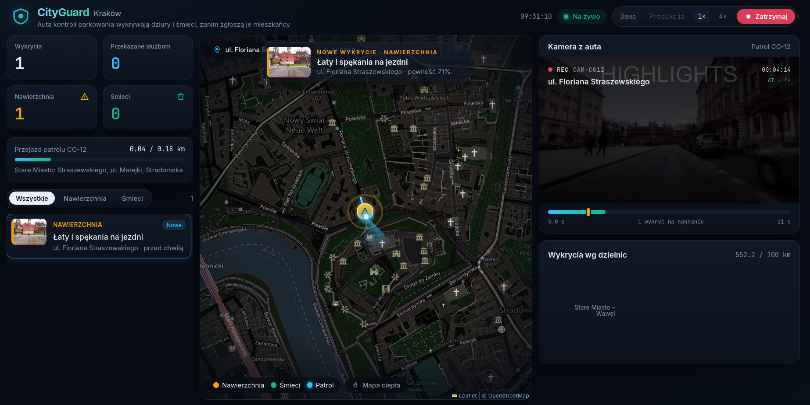
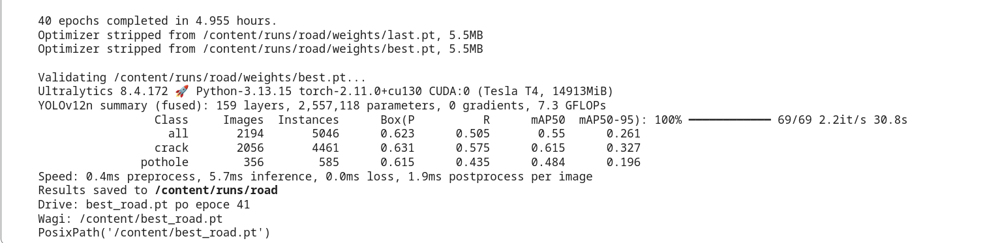
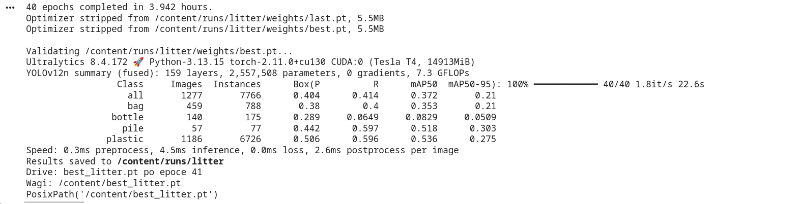

# CityGuard

Dashboard dla miasta: auta kontroli parkowania wykrywają dziury i śmieci przy drodze. Trening YOLO12 jest w Colabie. Laptop tylko inferuje i pokazuje alerty.



## Jak odpalić

Potrzebne: Python 3.12+, Node.js 22+. Z katalogu głównego:

```bash
./start.sh
```

Otwórz http://127.0.0.1:5173 i kliknij **Start przejazdu**. Pierwsze odpalenie samo stawia venv-y i `npm install`. **Demo** = etykiety z nagrania, **Produkcja** = modele YOLO. Ctrl+C gasi API i dashboard.

Ręcznie, dwa terminale (gdy wolisz):

```bash
backend/.venv/bin/uvicorn app.main:app --app-dir backend --port 8000
cd frontend && npm run dev
```

`docker compose up --build` stawia API i dashboard, ale bez workera YOLO — pełne demo odpalaj przez `./start.sh`.

Deploy na Render (jeden serwis, mock): instrukcja i Dockerfile w [`render/`](render/README.md).

## Trening (Colab)

1. W Colabie: Środowisko wykonawcze → Zmień typ środowiska → GPU (T4).
2. Wgraj `ml/train_road.ipynb` na jednym koncie i `ml/train_litter.ipynb` na drugim (nie mieszaj obu zbiorów na jednym dysku).
3. Road ściąga RDD2022 z Figshare (S3 SEKILab jest martwy). Zapas: `kaggle.json` + [aliabdelmenam/rdd-2022](https://www.kaggle.com/datasets/aliabdelmenam/rdd-2022). Litter ściąga pLitterStreet z Zenodo. Na krótką sesję ustaw `MAX_IMAGES` (np. 8000 / 4000).
4. Pobierz wagi i wrzuć do `ml/`:
   - `best_road.pt`
   - `best_litter.pt`
5. Opcjonalnie skopiuj tam też `yolo12n.pt` (wagi COCO). Inferencja użyje ich do rozmycia twarzy i tablic.

Walidacja po 40 epokach na T4:





## Film testowy

`data/demo.mp4` trwa 21 sekund, 1280×720, 15 kl./s. To początek jazdy autem przez centrum Krakowa (Wawel, Barbakan, zaparkowane auta przy krawężniku, znaki strefy P). Źródło: Relaxing Roads 4K, [CC BY 3.0](https://creativecommons.org/licenses/by/3.0/), [plik na Wikimedia](https://commons.wikimedia.org/wiki/File:City_Driving_4K-_Krak%C3%B3w_Poland_2024.webm). Na początku widać napis HIGHLIGHTS z oryginału.

Kamery [Cityscanner](https://mcx.pl/cityscanner/) patrzą w bok, z dachu, na tablice. Ten kadr jest z szyby, do przodu. Wolnego nagrania z bocznej kamery auta e-kontroli nie ma; film ZDM jest na [YouTube](https://www.youtube.com/watch?v=qg1LSP9cqag) i na [stronie ZDM](https://zdm.waw.pl/aktualnosci/pierwszy-dzien-z-e-kontrola-za-nami-zobaczcie-film/).

### Synchronizacja mapy z nagraniem

`data/route.json` to trasa z filmu, kluczowana sekundą nagrania: każdy punkt ma `t`, `lat`, `lon`, `street` i `segment`. Geometria pochodzi z OpenStreetMap (ways ul. Floriana Straszewskiego, pl. Jana Matejki, ul. Stradomska, ul. św. Gertrudy). Każde ujęcie ma długość czas × ~11,5 m/s, czyli tempo auta widoczne na filmie. Nagranie jest montażem trzech ujęć, więc między segmentami auto się teleportuje — bez linii przez kamienice. Backend, mapa i podgląd kamery idą po jednym zegarze:

- `POST /api/simulate/start` tyka co 0,25 s i rozsyła przez WebSocket `position` z polem `t` (sekunda nagrania), pozycją interpolowaną po czasie i nazwą ulicy;
- dashboard odtwarza `data/demo.mp4` (serwowane pod `/data/demo.mp4`) i dosuwa `currentTime` do `t`, gdy rozjazd przekroczy 0,6 s; tempo 4× ustawia też `playbackRate`;
- alerty nie są seedowane. Wchodzą dopiero po odpaleniu `ml/infer.py`.

Zmiana trasy = edycja `data/route.json` i restart API.

```bash
python3 -m venv ml/.venv
# /tmp ma quota — pip rozpakowuje koła na dysku domowym
mkdir -p "$HOME/.cache/pip-tmp"
TMPDIR="$HOME/.cache/pip-tmp" ml/.venv/bin/pip install -r ml/requirements.txt

# MVP: przejazd demo z ręcznymi etykietami z nagrania (bez wag YOLO)
ml/.venv/bin/python ml/infer.py --video data/demo.mp4 --mock
# to samo dwa razy szybciej
ml/.venv/bin/python ml/infer.py --video data/demo.mp4 --mock --speed 2
```

Przycisk „Start przejazdu” na dashboardzie robi to samo. Przełącznik **Demo / Produkcja** wybiera etykiety z nagrania albo nowe wagi `ml/best_road.pt` i `ml/best_litter.pt`. „Zatrzymaj” wysyła workerowi SIGINT.

### Tryb `--mock` (MVP)

Jedynym materiałem jest `data/demo.mp4`, więc zamiast modelu trenowanego na obcych zbiorach używamy ręcznie oznaczonych obiektów z tego nagrania: `data/annotations.json`. Każdy wpis ma sekundę nagrania `t`, typ (`road_damage` / `litter`), tytuł, pewność, `bbox` jako ułamki kadru i `offset_m` (przesunięcie pinezki w prawo od kursu, np. dla chodnika). Teraz jest tam 4× nawierzchnia (łaty na Podzamczu, wykruszona krawędź przy pl. Matejki, wyrwa i zapadnięty chodnik na Stradomskiej) i 2× śmieci (papier na jezdni na Stradomskiej, liście z błotem w kratce na św. Gertrudy).

Worker gra nagranie w czasie rzeczywistym (`--speed`): co 0,25 s wysyła pozycję z `running: true`, więc dashboard odtwarza wideo płynnie, a w sekundzie zdarzenia wycina klatkę, rysuje na niej ramkę i wysyła ją do `POST /api/events`. Na podglądzie kamery nic nie jest zaznaczane — miejsce wykrycia widać dopiero na tej statycznej klatce w szczegółach alertu. Ulicę i dzielnicę backend dopisuje z `video_t`. Ponowne odpalenie nie dubluje alertów, tylko podbija liczbę potwierdzeń (te same miejsca w promieniu 30 m).

### Tryb YOLO

```bash
ml/.venv/bin/python ml/infer.py --video data/demo.mp4
```

Klatki przejść montażu (średnia jasność < 60, napis HIGHLIGHTS) są pomijane, a ramki kończące się powyżej 55 % wysokości kadru (`--ground-y`) odpadają: dziury i śmieci leżą na ziemi, wyżej są niebo, fasady i napisy.

Potrzebne są wagi `ml/best_road.pt` i `ml/best_litter.pt` oraz działające API. `infer.py` liczy pozycję z czasu klatki (`CAP_PROP_POS_MSEC`) na tej samej trasie i wysyła ją do `POST /api/patrol/position`, więc mapa jedzie razem z inferencją (gdy akurat nie trwa symulacja). Z `--gpx` czas bierze się ze znaczników `<time>` śladu GPS.
